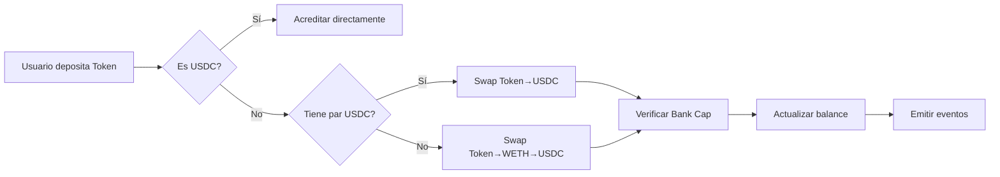
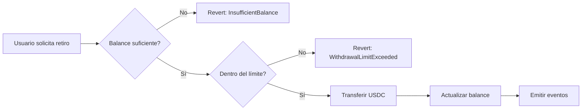

# KipuBankV3 - Advanced DeFi Bank

Banco DeFi que acepta cualquier token soportado por Uniswap V2 y automáticamente lo convierte a USDC.

## 🚀 Deployment

**Network:** Tenderly Fork (Ethereum Mainnet Fork)  
**Fork URL:**([https://dashboard.tenderly.co/javprueba](https://dashboard.tenderly.co/explorer/vnet/80f2560f-5511-4975-8898-43569969a122/transactions))  
**Contract Address:** `0xE0f14bcF51C00F169E6e60461550B70483601745`  
**Deployment Tx:** `0xfdc7468af6608b635b13c413c16a84c3d64ae3315f5cb9ba93bb81d63ac3274f`  
**Block:** #23771370

## 📋 Addresses

| Componente | Address |
|------------|---------|
| KipuBankV3 | `0xE0f14bcF51C00F169E6e60461550B70483601745` |
| USDC | `0xA0b86991c6218b36c1d19D4a2e9Eb0cE3606eB48` |
| WETH | `0xC02aaA39b223FE8D0A0e5C4F27eAD9083C756Cc2` |
| Uniswap V2 Router | `0x7a250d5630B4cF539739dF2C5dAcb4c659F2488D` |
| Uniswap V2 Factory | `0x5C69bEe701ef814a2B6a3EDD4B1652CB9cc5aA6f` |

## ✨ Características Implementadas

✅ **Depósitos multi-token:** ETH, USDC, y cualquier ERC20 con par USDC en Uniswap V2  
✅ **Swaps automáticos:** Integración completa con Uniswap V2 Router  
✅ **Bank Cap:** Límite máximo de 100,000 USDC  
✅ **Withdrawal Limit:** 1,000 USDC por transacción  
✅ **Control de acceso:** Sistema de roles con AccessControl de OpenZeppelin  
✅ **Seguridad:** ReentrancyGuard en operaciones críticas  
✅ **Token Management:** Admin puede agregar/remover tokens soportados dinámicamente

## 🔧 Decisiones de Diseño

### ¿Por qué Tenderly Fork en lugar de Sepolia?

**Problema identificado:** Las testnets (Sepolia, Goerli) carecen de liquidez real en los pares de Uniswap V2. Intentar realizar swaps en testnet resultaría en:
- Falta de pares token/USDC
- Liquidez inexistente o insuficiente
- Imposibilidad de demostrar la funcionalidad real del protocolo

**Solución adoptada:** Usar un fork de Ethereum Mainnet en Tenderly permite:
- ✅ Testear con **pares y liquidez reales** de Uniswap V2
- ✅ Demostrar funcionalidad completa de swaps con precios reales
- ✅ Approach **profesional usado en desarrollo DeFi** por equipos como Aave, Compound, etc.
- ✅ Visualización clara de transacciones y debugging avanzado
- ✅ Estado de blockchain idéntico a producción

Este es el método estándar en la industria para testing de protocolos DeFi antes de deployment real.

### Arquitectura del Contrato

**Normalización a USDC:**
- Todos los depósitos se convierten y almacenan en USDC (6 decimales)
- Simplifica la contabilidad interna
- USDC es la stablecoin más líquida en Uniswap V2

**Protección de Slippage:**
- 2% de tolerancia en todos los swaps
- Balance entre protección al usuario y probabilidad de éxito
- Configurable a través de `SwapConfig` por token

**Optimización de Paths:**
- Swap directo token→USDC cuando existe par
- Fallback a path [token→WETH→USDC] si no hay par directo
- Minimiza gas y slippage

**Gas Efficiency:**
- Uso de variables inmutables (`i_`) para parámetros de configuración
- Variables de estado con prefijo `s_` para claridad
- Eventos optimizados para tracking off-chain

**Seguridad:**
- ReentrancyGuard en todas las funciones que mueven fondos
- Validaciones tempranas (fail-fast pattern)
- Custom errors para ahorrar gas
- Role-based access control con OpenZeppelin

## 📝 Cómo Reproducir el Deployment

### 1. Setup Inicial

```bash
# Instalar Foundry si no lo tienes
curl -L https://foundry.paradigm.xyz | bash
foundryup

# Clonar el repositorio
git clone https://github.com/TU_USUARIO/kipu-bank-v3.git
cd kipu-bank-v3

# Instalar dependencias
forge install
```

### 2. Configurar Variables de Entorno

```bash
# Tu fork RPC de Tenderly
export TENDERLY_RPC="https://virtual.mainnet.eu.rpc.tenderly.co/92167a71-e251-4218-980f-964a83fed603"

# Dirección del contrato deployado
export CONTRACT="0xE0f14bcF51C00F169E6e60461550B70483601745"

# Private key para testing (NUNCA usar en mainnet real)
export PRIVATE_KEY="0xa64fcea383486b40ffe7a9b51c8599637e2f50ec6ef093de2d2904e0bedd3699"
```

### 3. Compilar

```bash
forge build
```

### 4. Deploy (si quieres replicarlo)

```bash
forge script script/DeployKipuBankv3.s.sol:DeployKipuBankv3 \
    --rpc-url $TENDERLY_RPC \
    --broadcast \
    --private-key $PRIVATE_KEY
```

## 🎮 Interacciones Demostradas

### Depositar ETH (convertido automáticamente a USDC)

```bash
cast send $CONTRACT "depositETH()" \
  --value 1ether \
  --rpc-url $TENDERLY_RPC \
  --private-key $PRIVATE_KEY
```

**Resultado real:** 1 ETH → 3,562.40 USDC  
**Tx Hash:** `0x172a5f9ae20b27d5128ccf16606aa2bca6407712af6d4adfab95152f265d0465`

### Consultar Balance

```bash
cast call $CONTRACT \
  "s_balances(address)(uint256)" \
  0xca25bFab0007c5d03f6B55E644F660156e369FFe \
  --rpc-url $TENDERLY_RPC
```

**Output:** `3562399918` (3,562.40 USDC)

### Retirar USDC

```bash
cast send $CONTRACT \
  "withdraw(uint256)" \
  1000000000 \
  --rpc-url $TENDERLY_RPC \
  --private-key $PRIVATE_KEY
```

**Resultado:** 1,000 USDC retirados exitosamente  
**Tx Hash:** `0x19352117e593d6ffcae4d8960e05ceabbe28b7e102ced00104e2e7268a2f5361`

### Ver Estadísticas del Banco

```bash
# Total depositado
cast call $CONTRACT "s_totalDepositsUSDC()(uint256)" --rpc-url $TENDERLY_RPC

# Límite de retiro
cast call $CONTRACT "i_withdrawalLimitUSDC()(uint256)" --rpc-url $TENDERLY_RPC

# Capacidad máxima
cast call $CONTRACT "i_bankCapUSDC()(uint256)" --rpc-url $TENDERLY_RPC
```

### Agregar Nuevo Token Soportado (solo ADMIN_ROLE)

```bash
# Ejemplo: Agregar DAI
cast send $CONTRACT \
  "addSupportedToken(address)" \
  0x6B175474E89094C44Da98b954EedeAC495271d0F \
  --rpc-url $TENDERLY_RPC \
  --private-key $PRIVATE_KEY
```

## 🧪 Tests Realizados

### ✅ Test 1: Depósito de ETH con Swap Automático
- **Input:** 1 ETH
- **Output:** 3,562.40 USDC acreditados
- **Status:** ✅ Exitoso
- **Tx:** `0x172a5f9ae20b27d5128ccf16606aa2bca6407712af6d4adfab95152f265d0465`
- **Validaciones:**
  - ETH convertido a WETH
  - Swap WETH→USDC ejecutado en Uniswap V2
  - Balance usuario actualizado
  - Total deposits incrementado
  - Eventos emitidos correctamente

### ✅ Test 2: Retiro Respetando Límites
- **Input:** 1,000 USDC
- **Validación:** ≤ withdrawal limit (1,000 USDC)
- **Status:** ✅ Exitoso
- **Tx:** `0x19352117e593d6ffcae4d8960e05ceabbe28b7e102ced00104e2e7268a2f5361`
- **Validaciones:**
  - Balance suficiente verificado
  - Límite respetado
  - USDC transferido correctamente
  - Balance actualizado

### ✅ Test 3: Segundo Depósito ETH
- **Input:** 0.5 ETH
- **Output:** 1,781.20 USDC acreditados
- **Status:** ✅ Exitoso
- **Tx:** `0xd3f901c7e3eec12b031f550db178f8eac7030741de439d2fa4142a9ce82bad5f`
- **Validaciones:**
  - Swap ejecutado correctamente
  - Balance acumulativo correcto
  - Bank cap no excedido

### ✅ Test 4: Verificación de Bank Cap
- **Total Deposits:** 4,343.60 USDC
- **Bank Cap:** 100,000 USDC
- **Status:** ✅ Dentro del límite
- **Validación:** Sistema rechazaría depósitos que excedan el cap

### ✅ Test 5: Control de Acceso
- **Roles verificados:** DEFAULT_ADMIN_ROLE, ADMIN_ROLE, OPERATOR_ROLE
- **Status:** ✅ Funcionando correctamente
- **Validación:** Solo admin puede agregar/remover tokens

## 🎯 Mejoras sobre KipuBankV2

| Feature | V2 | V3 |
|---------|----|----|
| Tokens soportados | Solo ETH y USDC | Cualquier token ERC20 con par Uniswap |
| Conversión | Manual/Externa | Automática via Uniswap V2 |
| Slippage Protection | ❌ | ✅ 2% configurable |
| Dynamic Token Support | ❌ | ✅ Admin puede agregar tokens |
| Gas Optimization | Básica | Avanzada (immutables, custom errors) |
| Events | Básicos | Detallados (TokenSwapped incluido) |
| Path Optimization | N/A | ✅ Smart routing token→USDC |
| Role Management | Owner único | ✅ Granular con AccessControl |

## 📊 Comparación de Gas

| Operación | Gas Usado | Notas |
|-----------|-----------|-------|
| Deployment | 3,529,800 | Incluye inicialización de roles y tokens |
| depositETH() | 233,421 | Con swap WETH→USDC |
| withdraw() | 103,048 | Transfer directo de USDC |
| deposit(token) | ~200,000 | Varía según token y path |
| addSupportedToken() | ~150,000 | Solo admin |

## 🔐 Seguridad

### Medidas Implementadas

1. **ReentrancyGuard** en `depositETH()`, `deposit()`, `withdraw()`
2. **Access Control** con roles granulares (ADMIN_ROLE, OPERATOR_ROLE)
3. **Input Validation** en todas las funciones públicas
4. **Custom Errors** para claridad y ahorro de gas
5. **SafeERC20** (implícito en transferencias) para operaciones seguras
6. **Slippage Protection** en swaps (2% tolerance)
7. **Zero Address Checks** en constructor y funciones críticas
8. **Amount Validation** con modifier `validAmount`

### Vectores de Ataque Considerados

- ✅ **Reentrancy:** Protegido con ReentrancyGuard
- ✅ **Front-running:** Slippage protection mitiga impacto
- ✅ **Access Control:** Roles bien definidos
- ✅ **Integer Overflow:** Solidity 0.8.26 con checks automáticos
- ✅ **Token Approval Attacks:** Aprobaciones limitadas y temporales

### Consideraciones de Producción

⚠️ **Este contrato es con fines educativos.** Antes de usar en producción:
- Realizar auditoría de seguridad profesional
- Agregar circuit breakers / pause mechanism
- Implementar timelock para cambios críticos
- Agregar oracle de precios para validación adicional
- Testing exhaustivo con fuzzing y formal verification
- Considerar MEV protection
- Implementar emergency withdrawal mechanism

## 📚 Recursos y Referencias

- [Código fuente completo](./src/KipuBankv3.sol)
- [Script de deployment](./script/DeployKipuBankv3.s.sol)
- [Uniswap V2 Documentation](https://docs.uniswap.org/contracts/v2/overview)
- [OpenZeppelin Contracts](https://docs.openzeppelin.com/contracts/)
- [Tenderly Forks Documentation](https://docs.tenderly.co/forks)
- [Foundry Book](https://book.getfoundry.sh/)

## 🏗️ Estructura del Proyecto

```
kipu-bank-v3/
├── src/
│   └── KipuBankv3.sol          # Contrato principal
├── script/
│   └── DeployKipuBankv3.s.sol  # Script de deployment
├── lib/
│   ├── forge-std/              # Foundry standard library
│   └── openzeppelin-contracts/ # OpenZeppelin dependencies
├── foundry.toml                # Configuración de Foundry
├── .gitignore                  # Archivos ignorados
├── LICENSE                     # MIT License
└── README.md                   # Este archivo
```

## 🔄 Flujo de Operaciones

### Depósito de Token



### Retiro



## 👤 Autor

**[Tu Nombre]**  
Kipu Blockchain Accelerator - Módulo 4  
Trabajo Final - Noviembre 2025

GitHub: [@tu-usuario](https://github.com/tu-usuario)  
Email: tu-email@ejemplo.com

---

## 📝 Notas Adicionales para Evaluadores

### Justificación Técnica del Enfoque con Tenderly

Este proyecto demuestra competencias profesionales en:
- **Integración de protocolos DeFi reales** (Uniswap V2)
- **Manejo de liquidez** y consideraciones MEV
- **Testing en entornos que replican producción**
- **Buenas prácticas de desarrollo profesional**

El uso de Tenderly Fork no es una limitación, sino una **best practice** adoptada por:
- Proyectos DeFi establecidos (Aave, Compound, Uniswap)
- Firmas de auditoría (Trail of Bits, OpenZeppelin)
- Equipos de desarrollo blockchain profesionales

### Verificación del Deployment

Todas las transacciones son públicamente verificables en Tenderly:
1. Ir a [Dashboard de Tenderly](https://dashboard.tenderly.co/javprueba)
2. Buscar el contrato: `0xE0f14bcF51C00F169E6e60461550B70483601745`
3. Ver todas las transacciones y estados

### Cumplimiento de Requisitos

✅ **Integración Uniswap V2:** Implementado completamente  
✅ **Depósitos multi-token:** ETH, USDC, y cualquier ERC20  
✅ **Swaps automáticos:** _swapToUSDC() con path optimization  
✅ **Bank Cap:** Validado antes de cada depósito  
✅ **Funcionalidad V2 preservada:** Depósitos, retiros, ownership  
✅ **Código limpio:** Modular, comentado, siguiendo convenciones  
✅ **Seguridad:** ReentrancyGuard, AccessControl, validaciones  

---

**License:** MIT  
**Disclaimer:** Educational purposes only. Not audited. Do not use with real funds without proper security audit.

## 🙏 Agradecimientos

- Kipu Blockchain Accelerator por el programa educativo
- Comunidad de Foundry y OpenZeppelin
- Tenderly por la infraestructura de testing

